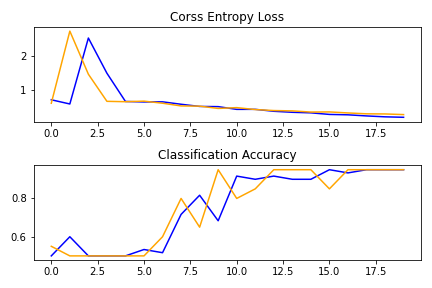
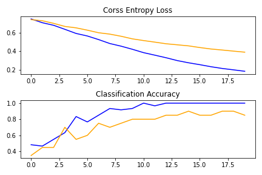
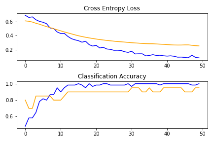

# CNN

In this repository, we have compare the performance of: baseline CNN, transfer learning with VGG1, and transfer learning with VGG1 with data augmentation on an image dataset. The code is borrowed from this post : (https://machinelearningmastery.com/how-to-develop-a-convolutional-neural-network-to-classify-photos-of-dogs-and-cats/). We selected dogs and pandas as objects for our dataset. We created a dataset of 80 images, with 40 images of dog and 40 images of pandas. The images for the dataset was taken from the internet.

The curated dataset is stored in `dataset` directory. Within the dataset directory there are `train` and `test` directories which furhter contains directories of `dogs` and `panda` containing the train and test images for both the classes.

* Baseline CNN

The baseline CNN model was implemented using keras in code `baseline_CNN.py`. The first block of baseline CNN model consists of 32 filters of size 3X3, followed by a max pooling of size of 2X2. Then the matrix is flatten and passed to a fully connected layer of output size 128 using a RELU activation. Finally that layer is passed to another fully connected layer with sigmoid activation.  

Binary cross-entropy loss was used. Stochastic gradient descent with learning rate of 0.001 was used to optimize the loss function. The plot for the model performance is shown below : 

    

The accuracy on test dataset was <b>95.00%</b>.

* VGG Transfer

VGG stands for <i>Visual Geometry Group</i>. The VGG architecture consists of blocks, where each block is composed of 2D convolution and Max Pooling layers. Transfer learning involves using all or parts of a model trained on a related task. The VGG transfer model was implemented using keras in code `VGG.py`. We have use the VGG16 model in keras to implement transfer learning with VGG. 

The plot for the model performance is shown below : 

    

The accuracy on test dataset was <b>85.00%</b>.

* VGG transfer + Augmentation

Image data augmentation is a technique that can be used to artificially expand the size of training dataset by creating modified versions of images. The VGG + Augmentation model was implemented using keras in code `VGG_agument.py`. 

The plot for the model performance is shown below : 

    

The accuracy on test dataset was <b>95.00%</b>.
