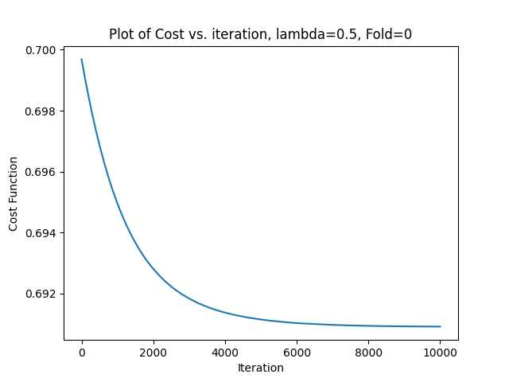

# Logistic Regression and CNN

## Logistic Regression 

The class for logistic regression is written in  `logisticRegression.py` file .

The code is pressure-tested on an random XOR Dataset of 150 points.

A XOR Dataset of 150 points were created from  `XOR_DAtaset.py` file. The XOR Dataset is shown in figure below.

    

The XOR dataset of 150 points were shplit in train/test ration of 60:40. The accuracy and MAE (Mean Absolute error) was computed. 

* By Direct Gradient computation
The train accuracy is 0.6333
The test accuracy is 0.6333
The test MAE is 0.50043.

* By Autograd Gradient computation
The train accuracy is 0.6333
The test accuracy is 0.6333
The test MAE is 0.50043

* Cross Entropy Loss and Regularization with lambda = 0.5
The train accuracy is 0.6333
The test accuracy is 0.6333
The test MAE is 0.50043.

The plot of decision surface is shown below : 

    

The plot of loss v/s iterations for lambda = 0 and 0.5 is shown below : 

    
    

The train and test accuracy with regularization as well as without regularization comes out to be <b>63.33%</b>.

The accuracy comes out to be 63.33% for both without and with L2-norm penalty. The points in the fourth quadrant are largely mis-classified. Also there are some blue points in first and third quadrant which are wrongly classified as red. 

The model is able to correctly predict only about 60% of samples. Moreover, the threshold for the probablity to class is set to be 0.5 (if p>0.5 predict 1 else predict 0). The boundary line for logistic regression is one single line, whereas XOR data has a natural boundary made up of two lines. Therefore, a single logistic regression can never able to predict all points correctly for XOR problem. 

## Logistic Regression fails on XOR dataset

Solving the same XOR classification problem with logistic regression of pytorch. Flax, Pytorch or Tensorflow provides their own implementaion of neural network. Note : Logistic regression is the simplest NN

The class for pytorch neural network single layer - logistic regression is written in  `pytorch_nn.py` file .

XOR Dataset is shown in figure below.

    

The dataset was split by train:test at 60:40 .

The plot of loss v/s iterations for all folds for lambda =0 and 0.5 is shown below : 

    
    

The plot of the decision surface is shown below for lambda 0 and 0.5 respectively : 

    
    

The train and test accuracy across XOR data for lambda =0 and lambda = 0.5 is as follows : 

lambda = 0
The train accuracy is 0.6000
The test accuracy is 0.6150
The test MAE for is 0.3850

lambda = 0.5
The train accuracy is 0.5467
The test accuracy is 0.4500
The test MAE for is 0.5100

As we are using single layer neural network of softmax function, we are implementing logistic regression itself which does not perform well with XOR dataset as can be seen from the decision boundary plots where many points are misclassified.

## Autogluon
Comparing the performances of differenct calssifiers on the XOR Dataset with <a href="https://auto.gluon.ai/stable/tutorials/tabular_prediction/tabular-quickstart.html">autogluon</a>.

A XOR Dataset of 1000 points is created.

The XOR dataset is split in train/test ratio of 60:40. The accuracy and MAE (Mean Absolute error) was computed. 

The final evaluation of the predictions given by all models is 

* Accuarcy = 0.9825

* Balanced Acuracy = 0.98301

* MCC = 0.9656

* f1 = 0.98271

* precision = 1.0

* recall = 0.96601

The leaderboard showing the individual performance of all models is given below:

    

## Multi-class Logistic regression

The class for multi-class logistic regression is written in  `multiclassLogisticRegression.py` file .

The class was tested on IRIS Dataset. IRIS Dataset was created using `IRIS_dataset.py`. The IRIS Dataset is shown in figure below.

    

The dataset was split by train:test at 80:20 using sklearn StratifiedKFold.

The plot of the decision surface is shown below : 

    

The plot of loss v/s iterations for all folds for lambda =0 and 0.5 is shown below : 

    
    

    
    

    
    

    
    

    
    

The train and test accuracy across all folds for lambda =0 and lambda = 0.5 is as follows : 

-----------------Fold 1------------------

lambda = 0
The train accuracy is 0.7917
The test accuracy is 0.7000
The test MAE for is 0.30000

lambda = 0.5
The train accuracy is 0.8000
The test accuracy is 0.7000
The test MAE for is 0.30000

-----------------Fold 2------------------

lambda = 0
The train accuracy is 0.7833
The test accuracy is 0.8000
The test MAE for is 0.20000

lambda = 0.5
The train accuracy is 0.7750
The test accuracy is 0.7667
The test MAE for is 0.23333

-----------------Fold 3------------------

lambda = 0
The train accuracy is 0.7667
The test accuracy is 0.9000
The test MAE for is 0.10000

lambda = 0.5
The train accuracy is 0.7833
The test accuracy is 0.8000
The test MAE for is 0.20000

-----------------Fold 4------------------

lambda = 0
The train accuracy is 0.7750
The test accuracy is 0.7667
The test MAE for is 0.23333

lambda = 0.5
The train accuracy is 0.7917
The test accuracy is 0.7667
The test MAE for is 0.23333

-----------------Fold 5------------------

lambda = 0
The train accuracy is 0.7917
The test accuracy is 0.7667
The test MAE for is 0.23333

lambda = 0.5
The train accuracy is 0.7750
The test accuracy is 0.8000
The test MAE for is 0.20000

The train and test accuracy is approximately 80%. From the plot of decision surface we can see that there are some yellow points mis-classified as blue and few blue points mis-classified as yellow. 

Since, the logistic regression has a linear boundary of separation and there are three classes. We can see two boundary lines producing three different regions. The blue and yellow points are difficult to separate by a single line. Therefore, we have some points mis-classified. 

* Using Pyorch neural network 

The decision surface is shown below : 

    

## CNN

The performance of baseline CNN, transfer learning with VGG1, and transfer learning with VGG1 with data augmentation on an image dataset are compared for a an image classification problem of dog and pands. See the folder <b>CNN</b> for more. 